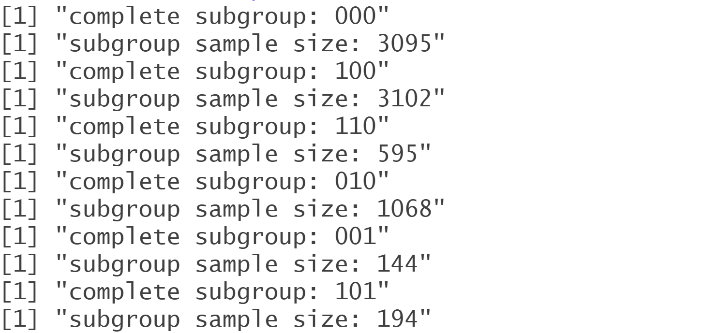
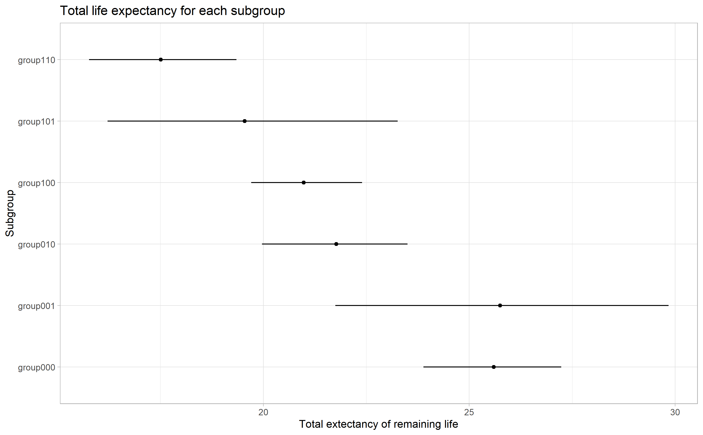

```{r, include = FALSE}
knitr::opts_chunk$set(message = FALSE, warning = FALSE)
```

```{r setup, include = FALSE}
library(bayesmlogit)
```

<body style="background-color:#FBFBFB;">

```{=html}
<style type="text/css">
.list-group-item.active, .list-group-item.active:focus, .list-group-item.active:hover {
    background-color: #D9230F;
}
  
</style>
```
## **0: Introduction**

We developed a Bayesian approach to estimate multi-state life tables, which can be useful for modelling a complex health process when numerous predisposing variables and coexisting health conditions are included. For details see [SM Lynch & Emma Zang](https://journals.sagepub.com/doi/abs/10.1177/00811750221112398).

This package involves two steps:

1)  Use `bayesmlogit()` to sample parameters from a multinomial logit model predicting transitions with chosen covariates (using Polya-Gamma latent variables to facilitate Gibbs sampling).

2)  Use `mlifeTable()` to generate multi-state life tables from the posterior samples and summarize quantities of interest from the tables.

In this article, we will take the 'lifedata' sample data set as an illustration and describe how to use our package to perform the Bayesian multi-state life table analysis. `lifedata` is extracted and processed from the data provided by The Health and Retirement Study ([HRS](https://hrs.isr.umich.edu/about)), which include three simple states: "health", "unhealthiness" and "death". For more details use `?lifedata()`.

Note that we only present an example in this post. The results are not representative of the entire population. In addition, our results are produced using the MCMC approach. With the same setup, you may obtain varying outcomes.

### **0.1: Installation**

To install this package. Try

```{r, echo=TRUE, eval=FALSE}
devtools::install_github("Xuezhixing-Zhang/bayesmlogit")
```

### **0.2: Obtain the Transitions**

Before employing the Markov chain Monte Carlo (MCMC) approach, we must determine the transitions of each subject. In `lifedata`, we have two states "health", "unhealthiness" and an end state "death", which can only happen when the subject is dead. Given a time interval, these states determine six kinds of possible transitions: 1:health to health; 2:health to unhealthiness; 3: health to death; 4: unhealthiness to health; 5: unhealthiness to unhealthiness; 6: unhealthiness to death.

The transitions can be obtained in two steps:

-   Eliminate subjects with only one observation.

-   Recode the transitions according to the table below:

 |               | Health        | Unhealthiness  |      Death     |
 | :-----------: |:-------------:|:--------------:|:--------------:|
 | Health        |       1       |       2        |       3        |
 | Unhealthiness |       4       |       5        |       6        |
 | Death         |       7       |       8        |       9        |

where the first column indicates the start state of subjects and the first row indicates the end state at this time interval. The numbers indicates the index of our transitions. Even though certain transitions in this table, such as "Death" to "Health," are impossible, we must nonetheless label them in this sequence. If transitions are not established in this order, computation errors may exist in the final results.

In the package, we provide a function `CreateTrans()` to help you create these transitions. You need to provide subject ID, age, current state, indicator of death and total number of states. Here is another example of this function's usage.

```{r}
#In this example, we generate 250 observations and 6 states (including death). Based on these observations, we apply the `CreateTrans()` function and generate the transitions.

#Create subject IDs for each observation. In this example, we have 50 subjects and 250 observations in total.
ID <- rep(1:50, each = 5) 

#Create Age variable for each observation.
Age <- rep(31:35, times = 50) 

#Create the current state for each observation. Without considering the end state "Death", we assume there are five other possible states. 
State <- sample(1:5,size=250,replace=TRUE)

#Create the indicator of death. All subjects in this example are presumed to have died at the last observation.
Death <- rep(c(0,0,0,0,1),times=50)

Example <- data.frame(ID,Age,State,Death)

#Use `CreateTrans()` to create transitions of each observation. Here we have six states in total: death and the other five possible states.
Example$trans <- CreateTrans(Example$ID,Example$Age,
                             Example$State,Example$Death,states=6)

#The transition for the first observation of each subject is NA because we cannot observe their previous states. 
head(Example,10)
```

## **1: Bayesmlogit Method**

After getting the transitions for each observation, we sample parameters from a multinomial logit model using the MCMC approach. The package provides the `bayesmlogit()` function for generating posterior samples. For further details use `?bayesmlogit()`.

Here is an example for this function:

```{r, eval = FALSE}
data <- lifedata
y <- data[,1]
X <- data[,-1]

# This example will take about 30 mins.
out <- bayesmlogit(y, X ,samp=1000, burn=500, step.width = 5, verbose=10)
```

Above codes generate 1000 posterior samples for `lifedata` after 500 burn-in samples. To reduce autocorrelation among each sample, we will select one sample from every five posterior samples.

The function has two outcomes: **out** and **outwstepwidth**. **out** contains all posterior samples generated after burn-in, while **outwstepwidth** includes only selected posterior samples. In this example, we wil have 1000 posterior samples in **out** and 200 samples in **outwstepwidth**.

## **2: Multi-state Life Table Method**

With posterior samples, we then compute the transition probability matrices and generate multi-state life tables.

### **2.1: Create Life Tables**

The life tables can be created by utilizing `mlifetable()`. Note that the variable "age" must be included in the data, which is necessary for calculating transition probabilities. 

```{r, eval = FALSE}
trans <- out$outwstepwidth
mlifeTable(y,X,trans =trans,
           groupby = c("male","black","hispanic"),
           vars = "mar",
           startages=50,
           age.gap=1,
           states=3,
           nums =200,
           file_path=".")

```

This function provides several options to generate life tables. `trans` is the posterior samples obtained from `bayesmlogit()`. `groupby` specifies the covariates to create subgroups. `vars` indicates the mediators in our analysis. `startages` is the start age for life tables. `age.gap` specifies the age interval for generating life tables. `states` is the total number of states in our data. `nums` is the posterior samples used to generate life tables. `file_path` gives the path for our outputs. We also provide other options for generating life tables, which can be found using `?mlifeTable()`. Each life table is a $\text{num} \times \text{states}$ matrix. In this example, six $200 \times 3$ life tables will be generated, corresponding to six subgroups.

### **2.2: Results**

When generating life tables, the function will index each subgroup and report sample size of each group:

{width="500"}

where "subgroup000" indicates "male = 0", "black = 0", "hispanic = 0" and "subgroup001" indicates "male = 0", "black = 0", "hispanic = 1". Other subgroups are also named in this order. All indexed life tables will be saved as ".txt" files in the specified path.

This step will output six life table files, corresponding six subgroups. Each life table will contain 200 lines, which are generated from 200 posterior samples. Without giving names of each state, the life table will appear as follows (Only show the first five lines):

```{r, echo = FALSE}

lifetable <- data.frame(V1 = c(12.26391,12.98282,11.97415,11.36613,10.32153),
                        V2 = c(12.37167, 13.26774, 13.92443, 13.62579, 13.61575),
                        V3 = c(35.37205, 33.85567, 34.11296, 35.02107, 36.06585))

head(lifetable)
```

where "V1", "V2" and "V3" correspond to the three states "health", "unhealthiness" and "death". The numbers below each state indicate the expected number of years that the population will remain in that state. When computing total life expectancy, we ignore the final column, "death," and sum the remaining columns.

### **2.3: Plots**

To summarize results of life tables and create simple plots, we can use the set `mlifeTable_plot = TRUE` in `mlifeTable()` or apply function `mlifeTable_plot()` to life tables. In the specified path, the function will create a file folder named "mplotResults" by default.

```{r, eval = FALSE}
#An example for generating plots with mlifeTable().
mlifeTable(y,X,trans =trans,
           groupby = c("male","black","hispanic"),
           vars = "mar",
           states=3,
           startages=50,
           age.gap=1,
           nums = 200,
           file_path=".",
           mlifeTable_plot = T,
           cred = 0.84)

#An example for generating plots with mlifeTable_plot():
mlifeTable_plot(X=lifedata[,-1],state.include = 0,
      groupby = c("male","black","hispanic"), 
      cred = 0.84, 
      states = 3,
      file_path = ".")

```

where `cred` is the credible level for summarizing credible intervals. The function will generate tables that summarize credible intervals and means for each subgroup's life expectancy. By default, we will get tables and figures for total life expectancy and state-specific life expectancies. Use `?mlifeTable()` and `?mlifeTable_plot()` for more details.

Without naming each state and subgroup, the total life expectancy tables and plots will appear as follows:

**Total Life Expectancy Table:**

```{r, echo = FALSE}

totallife <- data.frame(mean = c(25.594167,20.98344555, 17.5083547, 21.7699725, 25.7521784, 19.5448111),
                        left.bound = c(23.8903564, 19.7064424, 15.7686292, 19.9670376, 21.7483432, 16.220418),
                        right.bound = c(27.237894, 22.3996896, 19.3485968, 23.5050464, 29.8415952, 23.2624656),
                        subgroup = c("group000", "group100", "group110", "group010", "group001", "group101"))

totallife
```

**Total Life Expectancy Plot:**

{width="1500"}
